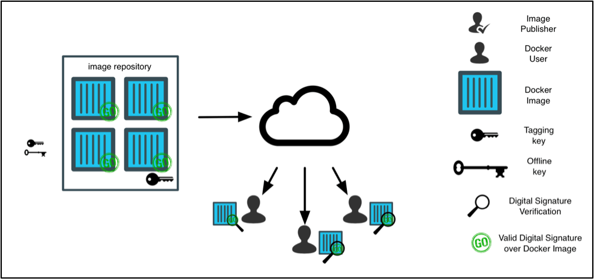

# 5 Best Practices for Container Image Security

In this post, I wanted to identify a few high-level security tips and best practices to consider when working with container images. Before diving into that, a very brief summary on the advantages of **containers**: Containers help organizations become more consistent, agile, and secure. These advantages are highlighted by allowing developers select the tools and environments that best suit their projects and applications. For operations teams, they now can focus on delivering these applications in a consistent and reliable way across multiple environments. Overall, these lead to faster/easier development and deployment, improving quality of code and release, thus decreasing costs and increasing customer satisfaction.

Now that we are clear on some of the high-level advantages, I will detail what a **container image** is. A container image is a collection of data that includes all files, software packages, and metadata needed to create a running instance of a container. In essence, an image is a template from which a container can be instantiated. Images are immutable, meaning, once they’ve been built, they cannot be changed. If someone were to make a change, a new image would be built as a result.

## Use images from trusted sources

Individuals and organizations should only work with images from trusted sources. Public images residing in Docker Hub may contain vulnerable software components, misconfiurations, or other security risks. Also, these images can be updated at any time, leading to the contents being in a state of flux. Developers relying on images from unreliable sources run the inherent danger of exposing their products, environments, and customers to any risks contained within these artifacts. 

Docker provides a solution to this trust principle by implementing a feature known as [Docker Content Trust](https://docs.docker.com/engine/security/trust/content_trust/). Docker Content Trust makes it possible to verify the publisher of Docker images. With Docker Content Trust, image publishers can sign their images with digital signatures and image users can ensure that the images they use are signed. 

The image below depicts how Docker Content Trust works:

## Use lightweight images

When selecting options for base images, it is generally a good practice to select a lightweight, simple, and efficient image.  [Alpine Linux](https://hub.docker.com/_/alpine) is an excellent base image choice, which leads to smaller image sizes overall. In addition to choosing a slim base image, it is important to only install the necessary packages and dependencies in the image needed to run the service or application effectively. This is a best practice for security as using smaller images will decrease the attack surface of the container overall. More packages in a container means more dependecies to manage, and more potential vulnerabilites to watch out for. From a developer efficiency perspective, building and deploying smaller images is easier and faster. This advantage directly aligns with one of our high-level advantages of containers: Faster development and deployment, boosting customer satisfaction.

## Scan images for vulnerabilities and enforce through policy

Most companies using containers are likely building images through continous integration systems like [Jenkins](https://jenkins.io/). Adding a mandatory step to scan these container images for vulnerabilities should be a security priority for organizations taking DevSecOps seriously. Although generating a list of packages and vulnerabilites within the image may seem sufficient enough, it often is just the beginning to a more robust security practice. **Policy enforcement** is a critical component DevSecOps teams should be in constant collaboration on. During a collaborative planning stage, team members should define a set of organizational-specific rules that can be enforced during the build stage of their container lifecycle. By taking a policy-based approach to security and best practices, requirements enforcement can be woven deeper into the fabric of the existing DevSecOps culture, allowing increased insight into any dynamic container workloads that break the agreed upon pre-defined rules.