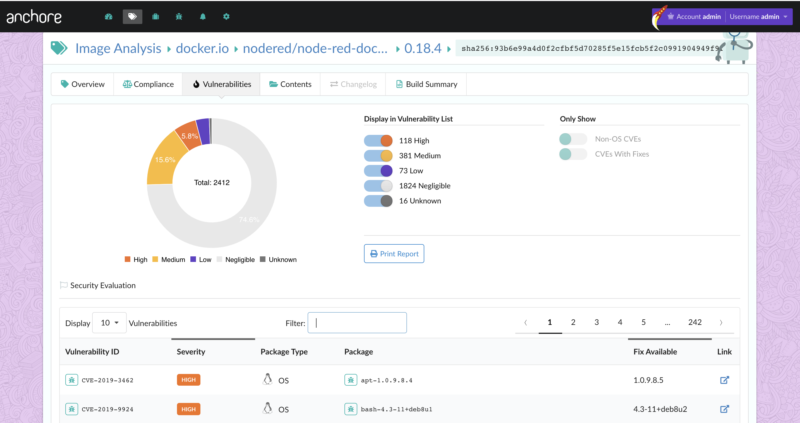

# Binding Operational Directive 19-02: Vulnerability Remediation Requirements for Internet-Accessible Systems

The Department of Homeland Security recently issued the [Binding Operational Directive 19-02](https://cyber.dhs.gov/bod/19-02/#when-do-the-15-and-30-day-clocks-start-for-remediation), "Vulnerability Remediation Requirements for Internet-Accessible Systems." A binding operational directive is a compulsory direction to the federal, executive branch, and departments and agencies for purposes of safeguarding federal information and information systems. Federal agencies are required to comply with DHS-developed directives. 

As the development and deployment of internet accessible systems increases across federal agencies, it is imperative for these agencies to identify and remediate any known vulnerabilities currently impacting the systems they manage. The purpose of BOD 19-02 is to highlight the importance of security vulnerability identification and remediation requirements for internet facing systems. Additionally, layout required actions for agencies when vulnerabilities are identified through Cyber Hygiene scanning. The Cybersecurity and Infrastructure Security Agency (CISA) leverages Cyber Hygiene scanning results to identify cross-government trends and persistent constraints, to help impacted agencies overcome technical and resources challenges that prevent the rapid remediation of security vulnerabilities. These Cyber Hygiene scans are in accordance with Office of Management and Budget (OMB) Memorandum [15-01: Fiscal Year 2014-2015 Guidance on Improving Federal Information Security and Privacy Management Practices](https://www.whitehouse.gov/sites/whitehouse.gov/files/omb/memoranda/2015/m-15-01.pdf), from which the NCCIC conducts vulnerability scans of agencies' internet-accessible systems to identify vulnerabilities and configuration errors. The output from these scans can be known as Cyber Hygiene reports, which score any identified vulnerabilities with the Common Vulnerability scoring system ([CVSS])(https://www.first.org/cvss/).

"To ensure effective and timely remediation of critical and high vulnerabilities identified through Cyber Hygiene scanning, federal agencies shall complete the following actions:"

**Review and Remediate Critical and High Vulnerabilities**

Review Cyber Hygiene reports issues by CISA and remediate any critical and high vulnerabilities detected on Internet-facing systems:

- Critical vulnerabilities must be remediated within **15 calendar days** of initial detection.
- High vulnerabilities must be remediated within **30 calendar days** of initial detection.

## How Anchore fits in

As federal agencies continue to transform their software development and deployment, it is necessary for them to incorporate proper security solutions purpose-built to identify and prevent vulnerabilities that are native to their evolving technology stack.

Anchore is a leading provider of container security and compliance enforcement solutions designed for open-source users and enterprises. Anchore provides vulnerability and policy management tools built to surface comprehensive container image package and data content, protect against security threats, and incorporate an actionable policy enforcement language capable of evolving as compliance needs change. Flexible and robust enough for the security and policy controls regulated industry verticals need to adopt cloud-native technologies in a DevSecOps environment. 

One of the critical points of focus here is leveraging Anchore to identify known vulnerabilities in container images. Anchore accomplishes this by first performing a detailed analysis of the container image, identifying all known operating system packages and third-party libraries. Following this, Anchore will map any known vulnerabilities to the identified packages within the analyzed image. 

### Viewing vulnerabilities in the UI

Anchore Enterprise customers can view identified vulnerabilities for analyzed images, by logging into the UI, and navigating to the image in question. 

**Note:** A list of vulnerabilities can also be viewed using the [Anchore CLI](https://github.com/anchore/anchore-cli) which can be configured to communicate with a running Anchore service.