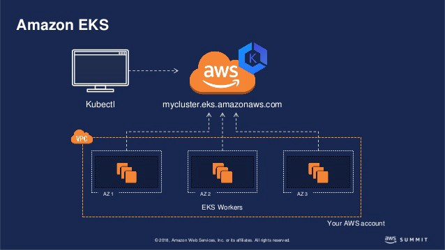
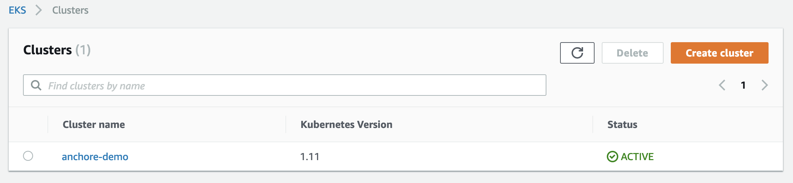
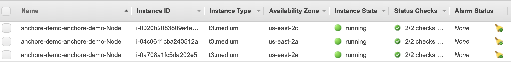
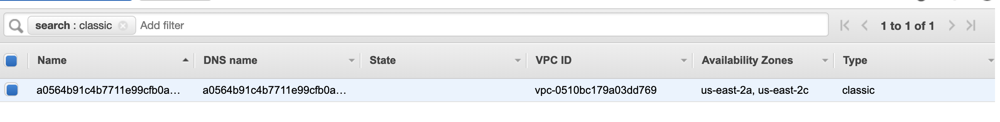
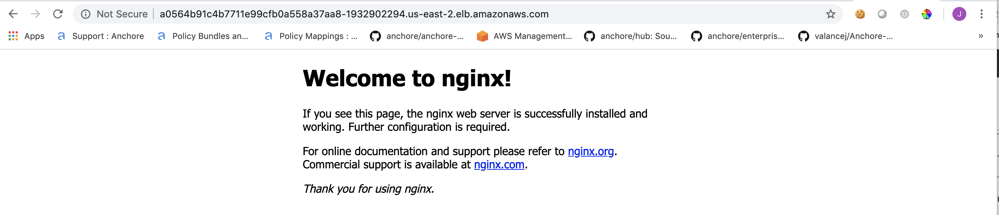

# Introduction to EKS



In June of 2018, Amazon announced the general availability of their [Elastic Container Service for Kubernetes](https://aws.amazon.com/blogs/aws/amazon-eks-now-generally-available/). Given that at Anchore we deliver our products as Docker container images, it came as no surprise to us that our users and customers would begin deploying our software on EKS. Since Kubernetes, Kubernetes on AWS, and Anchore on EKS adoption have all increased, I thought it best to give EKS a shot. 

### Getting started

For the scope of learning purposes, I thought I'd test out creating a EKS cluster, and launching a simple application. If you aren't completely familiar with Kubernetes I highly recommend checking out the [tutorials](https://kubernetes.io/docs/tutorials/kubernetes-basics/) section of the website just so some of the concepts and verbage I use make a little more sense. I also recommend reading about [**kubectl**](https://kubernetes.io/docs/reference/kubectl/overview/) which is the command line interface for running actions against Kubernetes clusters. 

In addition to the above reading, I also recommend the following:

- [Install kubectl](https://docs.aws.amazon.com/eks/latest/userguide/getting-started.html)
- [Install aws-iam-authenticator for Amazon EKS](https://docs.aws.amazon.com/eks/latest/userguide/install-aws-iam-authenticator.html)
- [Download and Install the Latest AWS CLI](https://docs.aws.amazon.com/cli/latest/userguide/cli-chap-install.html)

## Creating a cluster

There are a couple of ways to create an EKS cluster, with the console or with the AWS CLI.

**Create cluster using AWS console**

To begin, navigate here: https://us-east-2.console.aws.amazon.com/eks/home#/clusters and select *create cluster*.

There are several pieces of information you'll need to provide AWS for it to create your cluster successfully. 

- Cluster name (should be a unique name for your cluster)
- Role name
- VPC and Subnets
- Security groups

#### Role name

Here I will need to select the IAM role that will allow Amazon EKS and the Kubernetes control plane to manage AWS resources on my behalf. If you have not already, you should create an EKS service role in the IAM console. 

#### VPC and Subnets

Select a VPC and choose the subnets in the selected VPC where the worker nodes will run. If you have not created a VPC, you will need to create one in the VPC console, and create subnets as well. AWS has a great tutorial on VPC and Subnet creation [here](https://docs.aws.amazon.com/eks/latest/userguide/create-public-private-vpc.html).

**Note:** Subnets specified must be in at least two different availability zones. 

#### Security groups

Here I choose security groups to apply to network interfaces that are created in my subnets to allow the EKS control plane to communicate with worker nodes.

Once all the necessary requirements have been fulfilled, I can create the cluster. 

**Create cluster using AWS CLI**

I can also create a cluster via the AWS CLI by running the following:

`aws eks --region region create-cluster --name devel --role-arn arn:aws:iam::111122223333:role/eks-service-role-AWSServiceRoleForAmazonEKS-EXAMPLEBKZRQR --resources-vpc-config subnetIds=subnet-a9189fe2,subnet-50432629,securityGroupIds=sg-f5c54184`

I would simply update `--role-arn`, `subnetIds`, and `securityGroupIds` into the above command.

Once my cluster has been created the console looks like the following:



Next I can use the AWS CLI update-kubeconfig command to create or update my kubeconfig for my cluster.

`aws eks --region us-east-2 update-kubeconfig --name anchore-demo`

Then I test the configuration: `kubectl get svc`

Which outputs the following: 

```
NAME         TYPE        CLUSTER-IP   EXTERNAL-IP   PORT(S)   AGE
kubernetes   ClusterIP   172.20.0.1   <none>        443/TCP   7m
```

## Launch worker nodes

I created and launched worker nodes via the AWS CloudFormation console. It is important to note that Amazon EKS worker nodes are just standard Amazon EC2 instances. To create the stack, I simply selected **create stack** and added this Amazon S3 template URL: https://amazon-eks.s3-us-west-2.amazonaws.com/cloudformation/2019-02-11/amazon-eks-nodegroup.yaml, then I just filled out the parameters on the following screens. 

Next, I need to enable the worker nodes to join the cluster. I will do so by downloading and editing the AWS authenticator configuration map.

```
apiVersion: v1
kind: ConfigMap
metadata:
  name: aws-auth
  namespace: kube-system
data:
  mapRoles: |
    - rolearn: <ARN of instance role (not instance profile)>
      username: system:node:{{EC2PrivateDNSName}}
      groups:
        - system:bootstrappers
        - system:nodes
```

**Note:** The ARN of instance role is the **NodeInstanceRole** value you can see in the output of the creation of your CloudFormation stack.

Next, apply the configuration: `kubectl apply -f aws-auth-cm.yaml` and view the nodes: `kubectl get nodes`

```
NAME                                       STATUS    ROLES     AGE       VERSION
ip-10-0-1-112.us-east-2.compute.internal   Ready     <none>    3m        v1.11.5
ip-10-0-1-36.us-east-2.compute.internal    Ready     <none>    3m        v1.11.5
ip-10-0-3-21.us-east-2.compute.internal    Ready     <none>    3m        v1.11.5
```

I can also view them in the EC2 console:



### Working with Services

In Kubernetes, a LoadBalancer service is a service that points to external load balancers that are not in you kubernetes clusters. In the case of AWS, and this blog, an external load balancer (ELB) will be created automatically when I create a LoadBalancer service.

In order to do this, I must first define my service like so:

```YAML
# my-loadbalancer-service.yaml
apiVersion: v1
kind: Service
metadata:
  name: mylbservice
spec:
  type: LoadBalancer
  selector:
    app: nginx
  ports:
    - protocol: TCP
      port: 80
      targetPort: 80
```

Then I simply create the service.

`kubectl create -f my-loadbalancer-service.yaml`

To verify, I can describe my service.

`kubectl describe service`

Which outputs the following:

```
Name:                     mylbservice
Namespace:                default
Labels:                   <none>
Annotations:              <none>
Selector:                 app=nginx
Type:                     LoadBalancer
IP:                       172.20.16.171
LoadBalancer Ingress:     a0564b91c4b7711e99cfb0a558a37aa8-1932902294.us-east-2.elb.amazonaws.com
Port:                     <unset>  80/TCP
TargetPort:               80/TCP
NodePort:                 <unset>  32005/TCP
Endpoints:                10.0.1.100:80,10.0.1.199:80,10.0.3.19:80
Session Affinity:         None
External Traffic Policy:  Cluster
Events:
  Type    Reason                Age   From                Message
  ----    ------                ----  ----                -------
  Normal  EnsuringLoadBalancer  10m   service-controller  Ensuring load balancer
  Normal  EnsuredLoadBalancer   10m   service-controller  Ensured load balancer
```

I can see the created load balancer by navigating to the EC2 console and selecting *Load Balancers*



Or better yet, hit the LoadBalancer Ingress: 



### Conclusion

There is certainly a learning curve to Amazon EKS that requires a bit of knowledge on several different Amazon services in order to manage Kubernetes clusters effectively. By far the longest piece of this was getting the cluster set up. Any AWS-heavy users should be thrilled about the ability to make running containerized workloads in Kubernetes easy and cost-effective on the most popular cloud provider. With AWS still reigning as the top public cloud provider, it is only fitting Amazon created a service to adhere to the tremendous amount of container and Kubernetes adoption over the past two years. 

At Anchore, I'm always excited to work with our users and customers leveraging Amazon EKS to run Anchore. To find out more about how Anchore can be deployed, I highly recommend checking out our [helm chart](https://github.com/helm/charts/tree/master/stable/anchore-engine) and reading more about [Helm on EKS](https://medium.com/devopslinks/using-helm-to-install-application-onto-aws-eks-36840ff84555)

