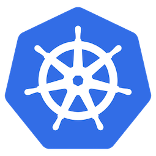
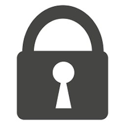

# Introduction to Kubernetes Security

 

## Background

Over the past couple of years the software community has seen the rise of [Kubernetes](https://kubernetes.io/). First developed by Google, Kubernetes is the most popular open-source container management tool which automates container deployment, container scaling, and container load balancing. A few of the major features and benefits of Kubernetes are: 

- Automatic Binpacking
- Service Discovery & Load Balancing
- Storage Orchestration
- Self Healing
- Horizonal Scaling

Kubernetes is also backed by a large community and hosted by the [Cloud Native Computing Foundation](https://www.cncf.io/). When organizations increase their use of containers some of the challenges they being to run into include: Automated scaling up and down of containers, container management and deployment, distributing load between containers, etc. To address these issues, it generally becomes necessary to implement a container orchestration platform to reduce operational burden. Kubernetes can be run on-premises or on any one of the major cloud providers (AWS, Azure, GCP, IBM Cloud).

Given that Kubernetes is already being used widely in production environments, securing these workloads should be a top priority. In this post, I will discuss a handful of common Kubernetes security basics and best practices to administer in order to avoid your clusters becoming compromised.  

### Staying up to date

As with any software component, updating to the latest version of software will greatly reduce the risk of your system being compromised. When running unpatched software components with known vulnerabilities, hackers are typically well-aware, and ready to exploit these weaknesses. One of the more recently well-known vulnerabilities discovered in Kubernetes was [CVE-2018-1002105](https://nvd.nist.gov/vuln/detail/CVE-2018-1002105). If you are running managed Kubernetes in a cloud provider, these managed service providers make it simple to upgrade to the latest version. In addition to running the latest version of Kubernetes, it is imperitive to stay up to date on the software components that make up the applications you are running. Providing your teams with the necessary tools for SAST for proprietary source code and container image scanning at the CI or container registry layer will help ensure that you are not running vulnerable software in Kubernetes environments. 

**Note:**: This includes the security and hardening of the underlying hosts. In a similar vein, make sure that Docker itself is also configured, secure, and best pracitices for Docker development are also being followed. 

### Resource Quotas

Take advantage of being able to define resource quotas for your Kubernetes resources. If resources are left unbounded, they have the potential to lead to total cluster unavailability and potentially draw on hardware resources as well. For more information on this, check out the [Resource Quotas](https://kubernetes.io/docs/concepts/policy/resource-quotas/) documentation.  

### Role-based Access Control

Kubernetes RBAC allows users to exercise fine-grained control over how users access the API resources running on your cluster. Cloud providers will likely have RBAC enabled by default, but it is a good practice to check to verify that your Kubernetes deployment has enabled this feature. Generally speaking, it is good practice to apply the principle of least privilege to make sure users and services only have the access needed to do their jobs. You can create RBAC permission that apply to your entire cluster, or to specific namespaces within your cluster. For more information of RBAC in Kubernetes, I recommend reading the Kubernetes documentation on [Using RBAC Authorization](https://kubernetes.io/docs/reference/access-authn-authz/rbac/). If you are using a cloud provider to manager Kubernetes I also recommend reading up on how each of these providers work with access and authentication as you may occasionally run into permission issues:

- [AWS Managing Cluster Authentication](https://docs.aws.amazon.com/eks/latest/userguide/managing-auth.html)
- [Making Sense of Kubernetes RBAC and IAM Roles on GKE](https://medium.com/uptime-99/making-sense-of-kubernetes-rbac-and-iam-roles-on-gke-914131b01922)
- [Access and identity options for Azure Kubernetes Service (AKS)](https://docs.microsoft.com/en-us/azure/aks/concepts-identity)

#### Role API

In the Kubernetes RBAC API, a role contains rules that represent a set of permissions. Below is an example Role in the default namespace that can be used to grant read access to pods: 

```YAML
kind: Role
apiVersion: rbac.authorization.k8s.io/v1
metadata:
  namespace: default
  name: pod-reader
rules:
- apiGroups: [""] # "" indicates the core API group
  resources: ["pods"]
  verbs: ["get", "watch", "list"]t
```

#### Principle of least privilege a step further

Above I mentioned applying the principle of least privilege to RBAC in Kubernetes. However, this same principle can be applied to your software components as well. By restricting access so components can only access the information and resources they need to operate correctly, the blast radius of attack is greatly reduced should one occur. 

### Enable Audit Logging

Kubernetes auditing provides a security-relevant chronological set of records documenting the sequence of activities that have affected the system by individual users, administrators or other components of the system. The logs will help to answer the following questions: What happened? When did it happen? Who initiated it? On what did it happen? Where was it observed? From where was it initiated? To where was it going? Additionally, shipping these logs off server and connecting to Splunk, Elasticsearch, Kafka, etc. to generate dashboards and alerts for suspicious activity will help with monitoring. 

### Create and Use Namespaces

Namespaces are essentially virtual clusters inside of your Kubernetes cluster. You can have multiple namespaces inside a single Kubernetes cluster, and they are all logically isolated from each other. Namespaces help with team organization, security, and performance. Kubernetes namespaces greatly help with organization as different development teams may have different environments and systems they will be working with. The creation of separate namespaces for teams, projects, and environments, will reduce the risk of a team accidentally overwriting or disrupting a service without realizing it. On the security side, imagine a scenario where a development team would like to maintain a space in the cluster with certain, more relaxed permissions, where they can build and run their application. The operations team would also like to maintain a space on the cluster where they can enforce strict procedures on who can or cannot manipulate the set of Pods, Services, and Deployments. By creating two namespaces, one for development, and one for production, these sets of permissions can be abstracted from each other while still allowing both teams to take advantage of the existing Kubernetes cluster. 

**Note:** In many cases the create and use of namespaces in Kubernetes can actually increase performance as the Kubernetes API will have a smaller set of objects to work with. 

### Create and Define Cluster Network Policies 

In Kubernetes a network policy is a specification of how groups of pods are allowed to communicate with each other and other network endpoints. Network Policies allow users to limit connections between Pods, this reduces the compromise radius. An example of a basic network policy would be: Block traffic from other namespaces by default. If you are further interested in network security for Kubernetes, I recommend taking a look at [Calico](https://www.projectcalico.org/) which is an open-source networking and network security solutions for containers, virtual machines, and native host-based workloads. 

### A change in security

Docker and Kubernetes have changed the way organizations need to implement best practices, policies, and security controls. With the increased adoption of microservices and containers, applications and their environments have become increasily dynamic. Container technologies allow for rapid development and deployment of applications, and traditional secruity models are not sufficiently scalable to meet the required security controls for highly-scalable automated solutions like Kubernetes. Security is every team members responsibility as Development, Platform, Network, QA, and Security teams are now required to collaboratively define the practices they would like in place in order to work together in a agile DevSecOps environment. 