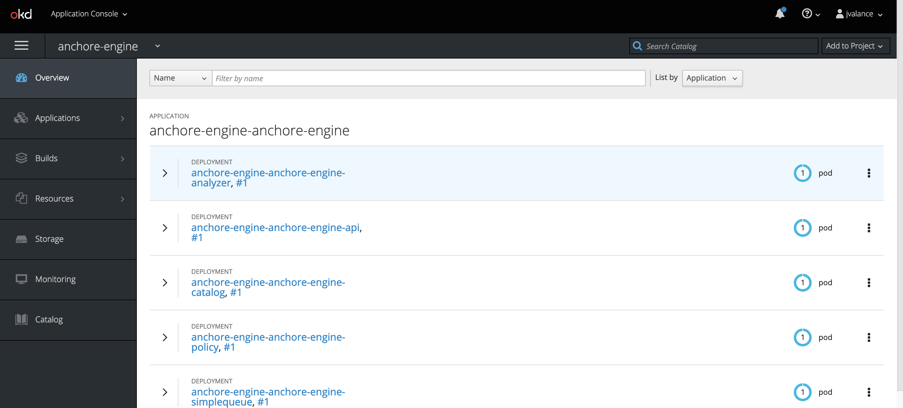
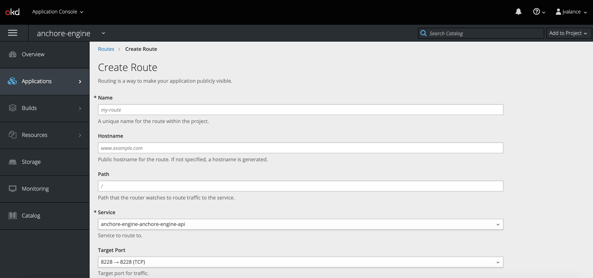
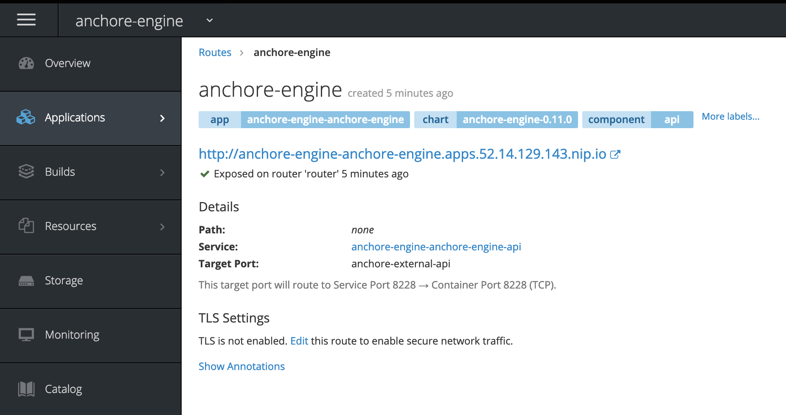
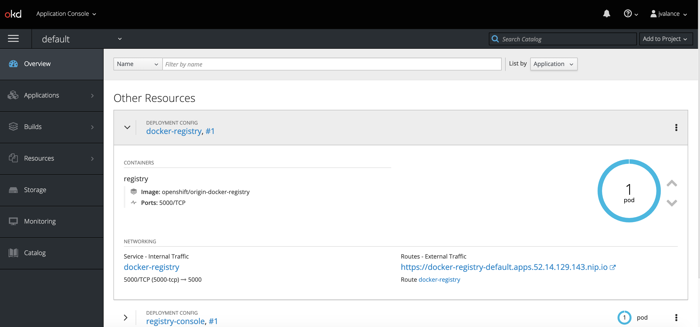

# Running Anchore Engine on Openshift

In this post, I will run through an installation of Anchore on OpenShift. I'll also discuss in brief how to use Anchore to scan images. 

## Getting started

My environment and tooling consists of the following: 

- CentOS 7 on AWS
- RedHat [OKD](https://www.okd.io/) version 3.11 in a single node
- [Helm](https://helm.io)
- PostgreSQL on RDS (For Anchore external DB)

For the purposes of this post, I will assume a successful installation of OKD and Helm. For more information on installing Helm on OpenShift see [here](https://blog.openshift.com/getting-started-helm-openshift/).

To verify that Helm has been installed and configured successfully, running the command below should yield the following output: 

```
[centos@ip-172-31-7-54 ~]$ helm version
\Client: &version.Version{SemVer:"v2.9.1", GitCommit:"20adb27c7c5868466912eebdf6664e7390ebe710", GitTreeState:"clean"}
Server: &version.Version{SemVer:"v2.9.1", GitCommit:"20adb27c7c5868466912eebdf6664e7390ebe710", GitTreeState:"clean"}
```

## Using the Anchore Helm chart

I will be installing Anchore via Helm and the chart located [here](https://github.com/helm/charts/tree/master/stable/anchore-engine).

For my installation, I've set up a PostgreSQl database in Amazon RDS that I will configure Anchore to use. Although there is a managed PostgreSQL service that can be installed with the chart, it is recommeded to use an external DB for production installations. 

### Configuring the external db

In order to configure the external db, create a new file named `anchore-values.yaml` and add the following: 

```YAML
## anchore-values.yaml

postgresql:
  # To use an external DB, uncomment & set 'enabled: false'
  # externalEndpoint, postgresUser, postgresPassword & postgresDatabase are required values for external postgres
  enabled: false
  postgresUser: db_username
  postgresPassword: db_password
  postgresDatabase: anchore_db

  # Specify an external (already existing) postgres deployment for use.
  # Set to the host and port. eg. mypostgres.myserver.io:5432
  externalEndpoint: anchore-db-instance.<123456>.us-east-2.rds.amazonaws.com:5432
```

For more details on using the Helm chart please consult the GitHub repo. 

## Installing Anchore 

Create a new project via `oc new-project anchore-engine`.

Give Tiller access to the project you created.

```
oc policy add-role-to-user edit "system:serviceaccount:${TILLER_NAMESPACE}:tiller" role "edit" added: "system:serviceaccount:tiller:tiller"
```

Verify you are using the created project.

```
[centos@ip-172-31-7-54 ~]$  oc login -u test -p test https://console.52.14.129.143:8443
Login successful.

You have access to the following projects and can switch between them with 'oc project <projectname>':

  * anchore-engine
    default
    kube-public
    kube-service-catalog
    kube-system
    management-infra
    openshift
    openshift-console
    openshift-infra
    openshift-logging
    openshift-metrics-server
    openshift-monitoring
    openshift-node
    openshift-sdn
    openshift-template-service-broker
    openshift-web-console
    tiller

Using project "anchore-engine".
```

Run the following command to install Anchore: 

```
helm install --name <release_name> -f anchore-values.yaml stable/anchore-engine
```

An initial install will take several minutes to complete. Additionally, it will also take some time to perform its initial data feed sync. 

You can run `oc get pods` to see how things are doing.

```
[centos@ip-172-31-7-54 ~]$ oc get pods
NAME                                                         READY     STATUS    RESTARTS   AGE
anchore-engine-anchore-engine-analyzer-7d5fc7fb4c-phkt8      1/1       Running   0          1h
anchore-engine-anchore-engine-api-55b785794-tk6qt            1/1       Running   0          1h
anchore-engine-anchore-engine-catalog-65bbfdd7c7-7ldzj       1/1       Running   0          1h
anchore-engine-anchore-engine-policy-8cb4787ff-sdw7v         1/1       Running   0          1h
anchore-engine-anchore-engine-simplequeue-5f7b7f866b-2hn2n   1/1       Running   0          1h
```

In addition, you can check on the installation via the OpenShift UI. 



#### Exposing the Anchore Engine service

Create a route in the OpenShift UI to expose the Anchore Engine service: 



The hostname of this route is what I will set our Anchore CLI URL environment variable to in the step below. 



#### Installing the Anchore CLI

I can now install the [Anchore CLI](https://github.com/anchore/anchore-cli) to interact with our running Anchore Engine service. There is also a [CLI container](https://hub.docker.com/r/anchore/engine-cli/).

Configure you Anchore CLI environment variables to communitate with the anchore engine API service. Now I can check on the status of the Anchore services by running `anchore-cli system status`.

```
[centos@ip-172-31-7-54 ~]$ anchore-cli system status
Service apiext (anchore-engine-anchore-engine-api-55b785794-5qn79, http://anchore-engine-anchore-engine-api:8228): up
Service simplequeue (anchore-engine-anchore-engine-simplequeue-5f7b7f866b-2hn2n, http://anchore-engine-anchore-engine-simplequeue:8083): up
Service policy_engine (anchore-engine-anchore-engine-policy-8cb4787ff-p8tpf, http://anchore-engine-anchore-engine-policy:8087): up
Service analyzer (anchore-engine-anchore-engine-analyzer-7d5fc7fb4c-2z85z, http://anchore-engine-anchore-engine-analyzer:8084): up
Service catalog (anchore-engine-anchore-engine-catalog-65bbfdd7c7-7ldzj, http://anchore-engine-anchore-engine-catalog:8082): up
```

You can also check on the stats of the vulnerability feeds sync by running the `anchore-cli system feeds list` command.

```
[centos@ip-172-31-7-54 ~]$ anchore-cli system feeds list
Feed                   Group                  LastSync                          RecordCount        
nvd                    nvddb:2002             2019-02-25T21:35:12.802608        6745               
nvd                    nvddb:2003             2019-02-25T21:35:13.188204        1547               
nvd                    nvddb:2004             2019-02-25T21:35:13.774093        2702               
nvd                    nvddb:2005             2019-02-25T21:35:14.281344        4749               
nvd                    nvddb:2006             2019-02-25T21:39:01.936476        7127               
nvd                    nvddb:2007             2019-02-25T21:39:02.432799        6556               
nvd                    nvddb:2008             2019-02-25T22:29:19.704624        7147               
nvd                    nvddb:2009             2019-02-25T22:29:20.292788        4964               
nvd                    nvddb:2010             2019-02-25T22:29:20.720235        5073               
nvd                    nvddb:2011             2019-02-25T21:30:43.003078        4621               
nvd                    nvddb:2012             2019-02-25T21:35:11.663650        5549               
nvd                    nvddb:2013             2019-02-25T21:39:01.289722        6160               
nvd                    nvddb:2014             2019-02-25T21:42:11.148478        8493               
nvd                    nvddb:2015             2019-02-25T21:44:55.773423        8023               
nvd                    nvddb:2016             2019-02-25T21:48:13.150698        9872               
nvd                    nvddb:2017             2019-02-25T22:03:35.550272        15162              
nvd                    nvddb:2018             2019-02-25T22:26:12.131914        13541              
nvd                    nvddb:2019             2019-02-25T22:29:19.116614        963                
vulnerabilities        alpine:3.3             2019-02-25T21:15:55.103331        457                
vulnerabilities        alpine:3.4             2019-02-25T21:15:55.428108        681                
vulnerabilities        alpine:3.5             2019-02-25T21:15:55.795007        875                
vulnerabilities        alpine:3.6             2019-02-25T21:15:56.135527        918                
vulnerabilities        alpine:3.7             2019-02-25T21:15:53.751574        919                
vulnerabilities        alpine:3.8             2019-02-25T21:15:54.071555        996                
vulnerabilities        amzn:2                 2019-02-25T21:15:54.417658        135                
vulnerabilities        centos:5               2019-02-25T21:15:50.007481        1323               
vulnerabilities        centos:6               2019-02-25T21:15:50.358919        1317               
vulnerabilities        centos:7               2019-02-25T21:15:58.630997        754                
vulnerabilities        debian:10              2019-02-25T21:15:50.692485        19674              
vulnerabilities        debian:7               2019-02-25T21:15:51.141333        20455              
vulnerabilities        debian:8               2019-02-25T21:15:51.509929        21179              
vulnerabilities        debian:9               2019-02-25T21:15:51.872651        19899              
vulnerabilities        debian:unstable        2019-02-25T21:15:56.488092        20427              
vulnerabilities        ol:5                   2019-02-25T21:15:56.879681        1228               
vulnerabilities        ol:6                   2019-02-25T21:15:57.226619        1382               
vulnerabilities        ol:7                   2019-02-25T21:15:57.570317        854                
vulnerabilities        ubuntu:12.04           2019-02-25T21:15:57.931096        14946              
vulnerabilities        ubuntu:12.10           2019-02-25T21:15:48.681891        5652               
vulnerabilities        ubuntu:13.04           2019-02-25T21:15:49.284442        4127               
vulnerabilities        ubuntu:14.04           2019-02-25T21:15:52.520471        17927              
vulnerabilities        ubuntu:14.10           2019-02-25T21:15:54.731972        4456               
vulnerabilities        ubuntu:15.04           2019-02-25T21:15:52.995122        5748               
vulnerabilities        ubuntu:15.10           2019-02-25T21:15:53.357807        6511               
vulnerabilities        ubuntu:16.04           2019-02-25T21:15:58.291030        14906              
vulnerabilities        ubuntu:16.10           2019-02-25T21:15:46.706940        8647               
vulnerabilities        ubuntu:17.04           2019-02-25T21:15:47.111422        9157               
vulnerabilities        ubuntu:17.10           2019-02-25T21:15:47.565082        7935               
vulnerabilities        ubuntu:18.04           2019-02-25T21:15:48.002361        9158               
vulnerabilities        ubuntu:18.10           2019-02-25T21:15:48.332466        7245     
```

Once the feeds and synced, you can now begin to can vulnerability matches back on any analyzed images that contain vulnerability packages (both os and non-os).

### Analyzing an image

The following commands are useful when analyzing images:

- `anchore-cli image add docker.io/library/nginx:stable` (Adds an image for analysis)
- `anchore-cli image wait docker.io/library/nging:stable` (Waits for an image to complete analysis)
- `anchore-cli image list` (Lists all images)

While these commands are fetching from Docker Hub, you can configure Anchore to scan images in private registries as well. For example, during my installation of OKD, a Docker registry was deployed automatically, as shown below.



I can use command Docker commands to push and pull images to and from this registry, and configure Anchore to watch images in this registry for updates. 

### Get a list of vulnerabilities

The following commands are useful when looking to obtain a list of vulnerabilites within an analyzed image.

- `anchore-cli image vuln docker.io/library/nginx:stable os` (Displays any os vulnerabilities)
- `anchore-cli image vuln docker.io/library/nginx:stable non-os` (Displays any non-os vulnerabilities)
- `anchore-cli image vuln docker.io/library/nginx:stable all` (Displays all vulnerabilities)

**Note:** If there are no vulnerabilities returned and you have a healthy Anchore Engine service, the image may not be triggering any vulnerability matches.  

## Conclusion

I have now successfully installed Anchore Engine on OpenShift with Helm and analyzed my first image. What I recommeded as a next step is to take a deeper looking into Anchore policies, and how you can use them to govern images running through a CI tool to potentially stop vulnerable images from making their way to production environments. You can find our more about policies by checking out our public facing documentation located [here](https://anchore.freshdesk.com/support/home).