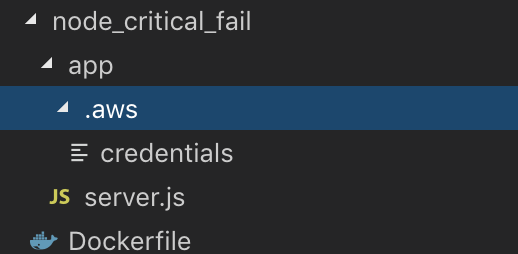
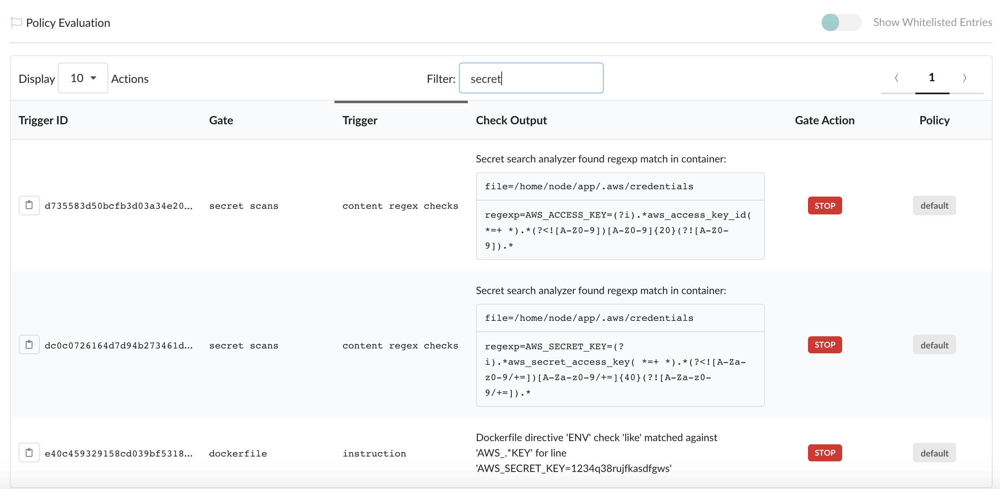

# Secrets enforcement with Anchore

Working with containerized applications inherently brings up the question of how to best give these applications access to any sensitive information they may need. This sensitive information can often be in the form of secrets, passwords, or other credentials. This week I decided to explore a couple of bad practices / common shortcuts and some simple checks to integrate into your testing to promote a more polished security model for container images. 

Historically, I've seen a couple "don'ts" for giving containers access to credentials: 

- Including directly in the source code
- Defining a secret in a Dockerfile with `ENV` instruction

The first should be an obvious no. Including this sensitive information in any source code that is managed by an SCM and eventually baked into the build image, especially any public repositories, is giving anyone access to repos those passwords, keys, creds, etc. I've also seen this placement of secrets inside of the container image using the `ENV` instruction.  `Dockerfiles` are likely managed somewhere, and exposing them in clear text is a practice that should be avoided. A recommended best practice is not only to check for keys and passwords as your images are being built, but implement the proper set of tools for true secrets management. There is an excellent article written by Hashicorp on [Why We Need Dynamic Secrets](https://www.hashicorp.com/blog/why-we-need-dynamic-secrets) which is a good place to start. 

### Using the ENV instruction

Below is a quick example of using the `ENV` instruction to define a variable called `AWS_SECRET_KEY`. Both AWS Access Keys consist of two parts: an access key ID and a secret access key. These credentials can be used with AWS CLI or API operations and should be kept private. 

```Dockerfile
FROM node:6

RUN mkdir -p /home/node/ && apt-get update && apt-get -y install curl
COPY ./app/ /home/node/app/

ENV AWS_SECRET_KEY="1234q38rujfkasdfgws"
```

For arguments sake, let’s pretend I built this image and ran the container with the following command: `docker run --name bad_container -d jvalance/node_critical_fail`

```
$ docker ps | grep bad_container
3bd970d05f16        jvalance/node_critical_fail     "/bin/sh -c 'node /h…"   13 seconds ago      Up 12 seconds         22/tcp, 8081/tcp         bad_container
```

and now `exec` into it with the following: `docker exec -ti 3bd970d05f16 /bin/bash` to bring up a shell. Then run the `env` command:

```
# env 
YARN_VERSION=1.12.3
HOSTNAME=3bd970d05f16
PWD=/
HOME=/root
AWS_SECRET_KEY=1234q38rujfkasdfgws
NODE_VERSION=6.16.0
TERM=xterm
SHLVL=1
PATH=/usr/local/sbin:/usr/local/bin:/usr/sbin:/usr/bin:/sbin:/bin
_=/usr/bin/env
```

Now you can see that I've just given anyone with access to this container the ability to grab any environment variable I've defined with the `ENV` instruction.

Similarly with the `docker inspect` command:

```
$ docker inspect 3bd970d05f16 -f "{{json .Config.Env}}"
["PATH=/usr/local/sbin:/usr/local/bin:/usr/sbin:/usr/bin:/sbin:/bin","NODE_VERSION=6.16.0","YARN_VERSION=1.12.3","AWS_SECRET_KEY=1234q38rujfkasdfgws"]
```

### Including in source code

Back to our example of a bad Dockerfile:

```Dockerfile
FROM node:6

RUN mkdir -p /home/node/ && apt-get update && apt-get -y install curl
COPY ./app/ /home/node/app/

ENV AWS_SECRET_KEY="1234q38rujfkasdfgws"
```

Here we are copying the contents of the app directory into home/node/app inside the image. Why is this bad? Here's an image of the directory structure:



and specifically the contents of the credentials file:

```
# credentials

[default]
aws_access_key_id = 12345678901234567890
aws_secret_access_key = 1a2b3c4d5e6f1a2b3c4d5e6f1a2b3c4d5e6f1a2b
[kuber]
aws_access_key_id = 12345678901234567890
aws_secret_access_key = 1a2b3c4d5e6f1a2b3c4d5e6f1a2b3c4d5e6f1a2b
```

Same as I did before, I'll try to find the creds in the container. 

```
/home/node/app# cat .aws/credentials 
[default]
aws_access_key_id = 12345678901234567890
aws_secret_access_key = 1a2b3c4d5e6f1a2b3c4d5e6f1a2b3c4d5e6f1a2b
api_key = 0349r5ufjdkl45
[kuber]
aws_access_key_id = 12345678901234567890
aws_secret_access_key = 1a2b3c4d5e6f1a2b3c4d5e6f1a2b3c4d5e6f1a2b
```

### Checking for the above with Anchore

At Anchore, a core focus of ours is centered around conducting a deep image inspection to give users comprehensive insight into the contents of their container images, and to provide users the ability to define flexible policy rules to enforce security and best-practices.

Using the policy mechanisms of Anchore, users can define a collection of checks, whitelists, and mappings (encapsulated as a self-contained Anchore policy bundle document). Anchore policy bundles can then be authored to encode a variety of rules, including checks within (but not limited to) Dockerfile line checks and presence of credentials. Although, I will never recommend the bad practices used in the above examples for secrets, we should be checking for them nonetheless. 

#### Policy bundle

A policy bundle is a single JSON document, which is composed of:

- **Policies**
- Whitelists
- Mappings
- Whitelisted Images
- Blacklisted Images

The **policies** component of a bundle define the checks to make against an image and the actions to recommend if the checks to find a match. 

Example policy component of a policy bundle:

```JSON
"name": "Critical Security Policy",
  "policies": [
    {
      "comment": "Critical vulnerability,  secrets, and best practice violations",
      "id": "48e6f7d6-1765-11e8-b5f9-8b6f228548b6",
      "name": "default",
      "rules": [
        {
          "action": "STOP",
          "gate": "dockerfile",
          "id": "38428d50-9440-42aa-92bb-e0d9a03b662d",
          "params": [
            {
              "name": "instruction",
              "value": "ENV"
            },
            {
              "name": "check",
              "value": "like"
            },
            {
              "name": "value",
              "value": "AWS_.*KEY"
            }
          ],
          "trigger": "instruction"
        },
        {
          "action": "STOP",
          "gate": "secret_scans",
          "id": "509d5438-f0e3-41df-bb1a-33013f23e31c",
          "params": [],
          "trigger": "content_regex_checks"
        },...
```

The first policy rule uses the `dockerfile` gate and instruction trigger to look for AWS environment variables that may be defined in the Dockerfile.

The second policy rule uses the `secret scans` gate and content regex checks trigger to look for AWS_SECRET_KEY and AWS_ACCESS_KEY within the container image. 

It it worth noting that there is an `analyzer_config.yaml` file which is taking care of the regex definitions. See [here](https://github.com/anchore/anchore-engine/blob/master/anchore_engine/conf/analyzer_config.yaml).

For the purposes of this post I've analyzed an image that includes the two bad practices discussed earlier, and evaluated the analyzed image against a policy bundle which contains the rule definitions above. It should catch the poor practices!

Here is a screenshot of the Anchore Enterprise UI Policy Evaluation table:



The check output column clearly informs us what Anchore found for each particular trigger ID line item and importantly, the **STOP** action which helps to determine the final result of the policy evaluation.

We can see very clearly that these policy rule definitions have caught both the `ENV` variable and credentials file. If this were plugged into a continous integration pipeline, we could fail the build on this particular container image, and put the responsibility on the developer to fix, rebuild, and never ship this image to a production registry. 

### Putting this in practice

In summary, it is extremely important to put checks in-place with a tool like Anchore to align with your container image build frequency. For secrets management, an overall best practice I recommend is using a secret store like [Vault](https://www.hashicorp.com/products/vault/) to handle the storage of sensitive data. Depending on the orchestrator you are using for your containers, there are some options. For Kubernetes, there is [Kubernetes Vault](https://github.com/Boostport/kubernetes-vault). Staying with the Hashicorp suite, there are some options here as well for dynamic secrets: [Vault Integration and Retrieving Dynamic Secrets](https://www.nomadproject.io/guides/operations/vault-integration/index.html). 

The above is an excellent system to have in place. I will continue to advocate for including image scanning and policy enforcement as a mandatory step in continuous integration pipelines, because it directly aligns with the practice of bringing security as far left in the development lifecycle as possible to catch issues early. Taking a step back to plan and put in place solutions for managing secrets for your containers, and securing your images, will drastically improve your container security stance from end to end and allow you to deploy with confidence.

