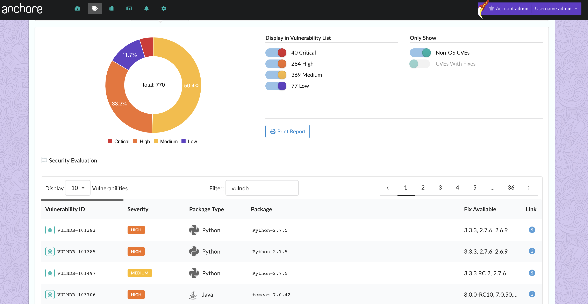
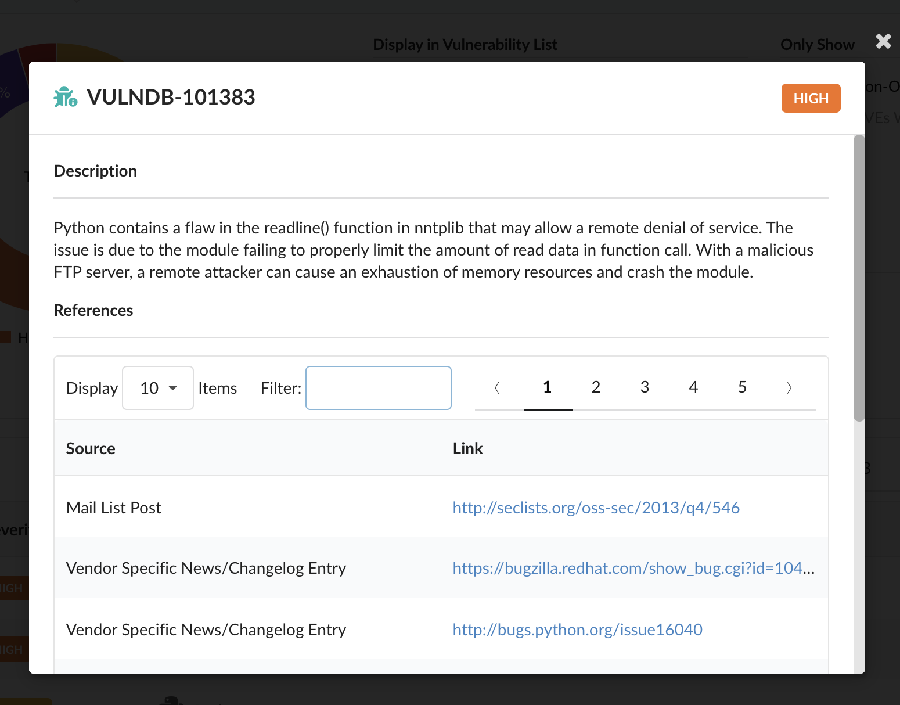

# Anchore Enterprise 2.1 Feature Series: Enhanced Vulnerability Data

With the release of [Anchore Enterprise 2.1](https://anchore.com/announcing-anchore-enterprise-2-1/) (based on [Anchore Engine 0.5.0](https://anchore.com/opensource/)), we are pleased to annouce that Anchore Enterprise customers will now receive access to enhanced vulnerability data from Risk Based Security's VulnDB for increased fidelity, accuracy, and live-ness of image vulnerability scanning results. 

Recognizing that container images need an added layer of security, Anchore conducts a deep image inspection and analysis to uncover what software components are inside of the image, and generate a detailed manifest that includes packages, configuration files, language modules, and artifacts. Following analysis, user-defined acceptance policies are evaluated against the analyzed data to cerfity the container images. 

As the open source software components and their dependencies within container images quickly increase so do the inherent security risks these packages often present. Anchore software will identify all operating system and supported language packages (NPM, Java, Python, Ruby), and importantly, map these packages to known vulnerabilities. In addition to package identification, Anchore also indexes every file in the container image filesystem providing end users complete visability into the full contents.  

**Risk Based Security's VulnDB**

VulnDB provides the richest, more complete vulnerability intelligence available to help users and teams address points of risk across their organization - in the case of Anchore customers, security risks within container images. VulnDB provides over *70,000* additional vulnerabilities not found in the publically available source Common Vulnerabilities and Exposures (CVE) database. Additionally, 45.5% of 2018 omission from the CVE database are high to critical in severity. This ties directly into a key understanding we have here at Anchore - Just being reliant on publically available vulnerability sources are not sufficient for Enterprises looking to seriously improve their security posture. 

## Viewing vulnerability results in the Anchore UI

Just as in previous releases, Anchore Enterprise users can view vulnerability results for image in the UI. 

**Below is a snapshot of Anchore Enterprise with vulnerable packages identified by VulnDB:**

Diving deeper into a single VulnDB identifier presents the user with more information about the issue, and provides links to external sources. 

**Below is a single VulnDB identifier record in Anchore Enterprise:**

**Note:** As always, users can fetch vulnerability information via the Anchore API or CLI.

Given that more organizations are increasing their use of both containers and OSS components, it is becoming more critical for enterprises to have the proper mechanisms in place to uncover and fix vulnerable packages within container images as early as possible in the development lifecycle.

