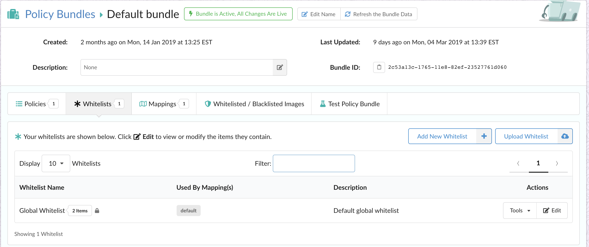
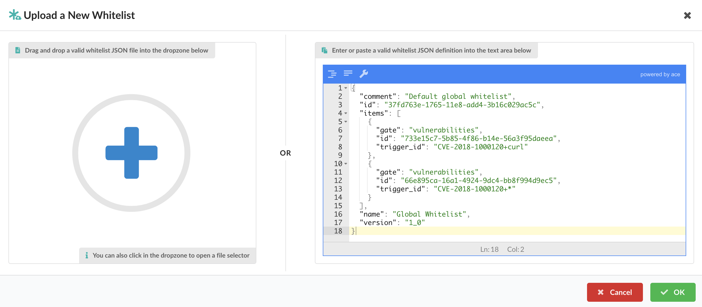
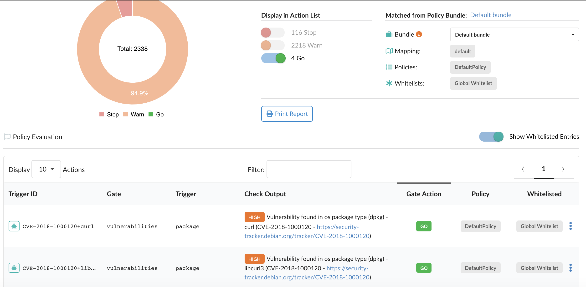
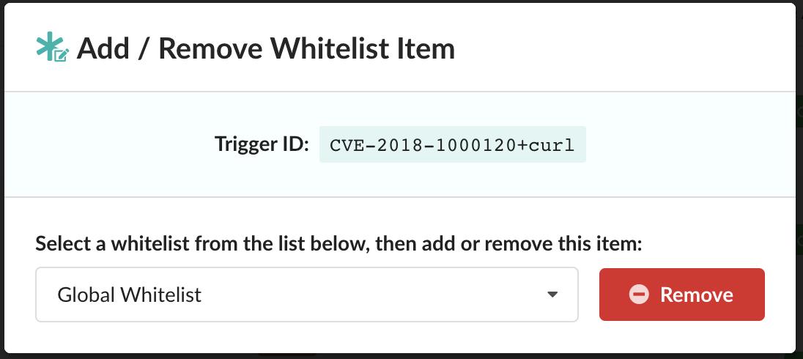
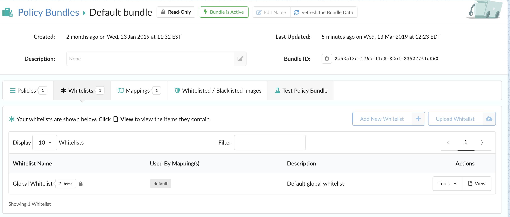

## Whitelisting in Anchore

At Anchore, we are consistently working with our users and customers to help them gain better insight into the contents of their container images, and more importantly, helping them create rules to enforce security, compliance, and best practices. The enforcement element is achieved through Anchore policy evaluations, and more specifically, the rules are defined within the policies component of a policy bundle. 

Anchore policy bundles are the unit of policy definition and evaluation. Anchore users may have multiple policy bundles, but for a policy evaluation, the user must specify a bundle to be evaluated or default to the bundle currently marked as active. One of the components of a policy bundle is whitelists. A whitelist is a set of exclusion rules for trigger matches found during policy evaluation. A whitelist defines a specific gate and trigger_id that should have it's action recommendation statically set to **_go_**. When a policy rule result is whitelisted, it is still present in the output of the policy evaluation, but it's action is set to **_go_** and it is indicated that there was a whitelist match. The overarching idea though, is to give developers, ops, and security team members an effective mechanism for ignoring vulnerability matches that are known to be false positive, or ignoring vulnerabilities on specific packages (if they have been patched), or any other agreed upon reason for creating a whitelist rule. 

### Whitelists in Anchore Enterprise

Within the Anchore Enterprise UI, navigating to the Whitelists tab will show the lists of whitelists that are currently present in the current policy bundle. 



Selecting the edit button on the far right under the action column, will bring up the whitelist editor where users have the ability to create new whitelist entries or modify existing ones. 


The example whitelist above is represented as JSON below: 

```JSON
{
  "comment": "Default global whitelist",
  "id": "37fd763e-1765-11e8-add4-3b16c029ac5c",
  "items": [
    {
      "gate": "vulnerabilities",
      "id": "733e15c7-5b85-4f86-b14e-56a3f95daeea",
      "trigger_id": "CVE-2018-1000120+curl"
    },
    {
      "gate": "vulnerabilities",
      "id": "66e895ca-16a1-4924-9dc4-bb8f994d9ec5",
      "trigger_id": "CVE-2018-1000120+*"
    }
  ],
  "name": "Global Whitelist",
  "version": "1_0"
}
```

#### Components of a Whitelist in Anchore

- **Gate:** The gate to whitelist matches from (ensures *trigger_ids* are not matched in the wrong context).
- **Trigger Id:** The specific trigger result to match and whitelist. This id is gate/trigger specific as each trigger may have its own *trigger_id* format. Most commonly, the CVE trigger ids produced by the *vulnerability package* gate-trigger. The *trigger_id* may include wildcards for partial matches as shown with the second item.
- **Id:** An identifier for the whitelist rule. Only needs to be unique within the whitelist object itself. 

It is important to note that if a whitelist item matches a policy trigger output, the action for that particular output is set to **_go_** and the policy evaluation result will inform the user that the trigger output was matched for a whitelist item. 

#### Uploading a Whitelist in Anchore Enterprise

Through the UI, Anchore users have the option to upload a whitelist by selecting the Upload Whitelist button which brings up the following:



#### Viewing Whitelisted Entries

Anchore users can view the whitelisted entries in the Policy Evaluation table as shown below:



Additionally, users can optionally Add / Remove a particular whitelist item as shown below:



### Conclusion

When working with the security risks associated with both operating system and non-operating system packages, ignoring issues is sometimes a necessary action. At Anchore, the goal is to provide teams a solid means of managing vulnerabilities and packages that may need to be suppressed. Due to the fact that working with whitelists and policies carries a certain level of risk, Anchore Enterprise provides role based access control to make policy editing only available to users who have been assigned the appropriate level of permissions. In the example below, the current user only has 'read-only' access and cannot make any changes to the whitelist. 

