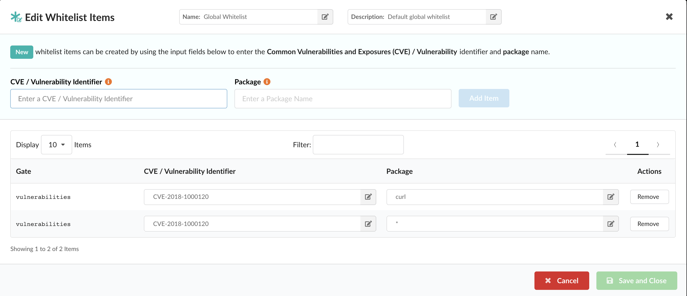

## Whitelisting in Anchore

At Anchore, we are consistently working with our users and customers to help them gain better insight into the contents of their container images, and more importantly, helping them create rules to enforce security, compliance, and best practices. The enforcement element is achieved through Anchore policy evaluations, and more specifically, the rules are defined within the policies component of a policy bundle. 

Anchore policy bundles are the unit of policy definition and evaluation. Anchore users may have multiple policy bundles, but for a policy evaluation, the user must specify a bundle to be evaluated or default to the bundle currently marked as active. One of the components of a policy bundle is whitelists. A whitelist is a set of exclusion rules for trigger matches found during policy evaluation. A whitelist defines a specific gate and trigger_id that should have it's action recommendation statically set to **_go_**. When a policy rule result is whitelisted, it is still present in the output of the policy evaluation, but it's action is set to **_go_** and it is indicated that there was a whitelist match. The overarching idea though, is to give developers, ops, and security team members an effective mechanism for ignoring vulnerability matches that are known to be false positive, or ignoring vulnerabilities on specific packages (if they have been patched), or any other agreed upon reason for creating a whitelist rule. 

### Whitelists in Anchore Enterprise

Within the Anchore Enterprise UI, navigating to the Whitelists tab will show the lists of whitelists that are currently present in the current policy bundle. 


Selecting the edit button on the far right under the action column, will bring up the whitelist editor where users have the ability to create new whitelist entries or modify existing ones. 



This example whitelist above is represented as JSON below: 

```JSON
{
  "comment": "Default global whitelist",
  "id": "37fd763e-1765-11e8-add4-3b16c029ac5c",
  "items": [
    {
      "gate": "vulnerabilities",
      "id": "733e15c7-5b85-4f86-b14e-56a3f95daeea",
      "trigger_id": "CVE-2018-1000120+curl"
    },
    {
      "gate": "vulnerabilities",
      "id": "66e895ca-16a1-4924-9dc4-bb8f994d9ec5",
      "trigger_id": "CVE-2018-1000120+*"
    }
  ],
  "name": "Global Whitelist",
  "version": "1_0"
}
```